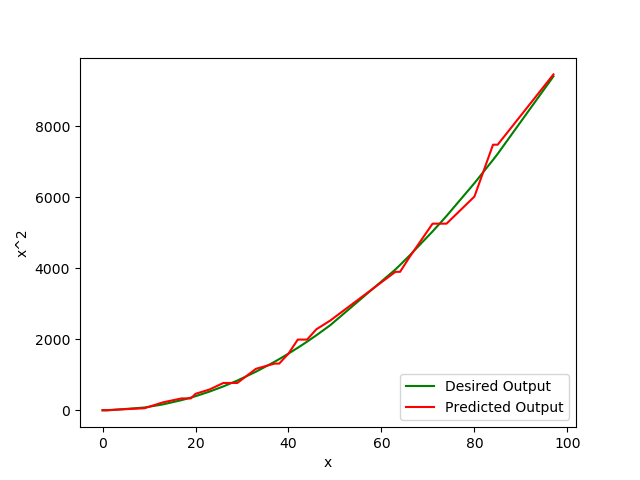
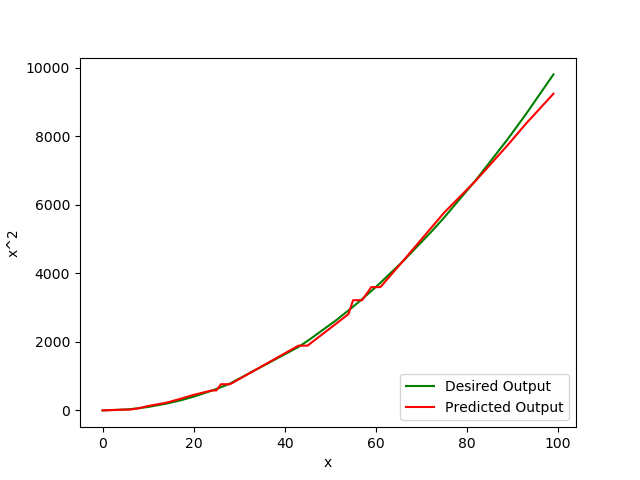

# Cerebellar-Model-Articulation-Controller
This is a model derived from the classic perceptron model.

Number of weights: 35
Number of  training samples: 70
Number of testing samples: 30
Number of Association cells can be calculated as: 

    number of association cells = number of weights - Generalizing factor + 1

### Hyperparamters
1. Epochs
2. Learning rate
3. Generalizing factor
4. Accuracy threshold
5. Convergence Rate
### Run Discrete CMAC

    python3 cmac_discrete.py
 

### Run Continuous CMAC

    python3 cmac_continuous.py
 

